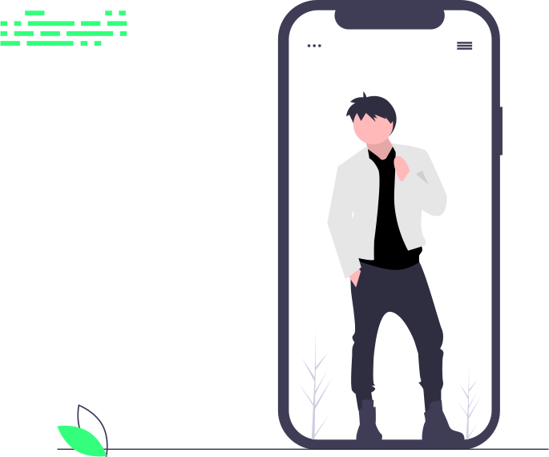

## Hi, I'm [Pankaj Joshi]👋

- 🔭 I’m currently developing a mobile app
- 🌱 I’m currently learning advanced concepts of React Native and GraphQL
- ⚡ Fun fact: I love to do calisthenics

**Connect with me:**

[][website]
[][youtube]
[][twitter]
[][linkedin]
[][facebook]

 
 

**Languages and Tools:**

<code></code>
<code></code>
<code></code>
<code></code>
<code></code>

 
 

---

[website]: https://www.facebook.com/
[twitter]: https://twitter.com/obirin_10
[youtube]: https://www.youtube.com/channel/UCxZae3CckJZ2V-WaNQLbeRg
[facebook]: https://facebook.com/
[linkedin]: https://linkedin.com/in/pankaj-joshi
